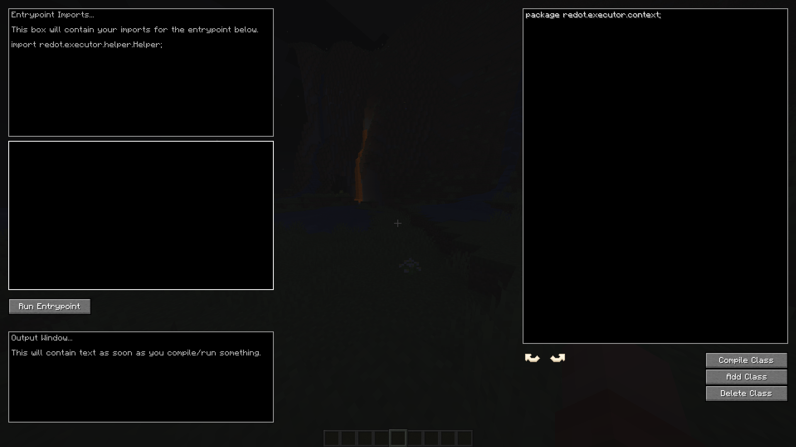

Concurrent Executor
-
A mod allowing its users to write, compile and run code during a Minecraft runtime.

---

### ⚠️ Warning

This project has reached its end of life. Check out [TweakSuite](https://github.com/Rehdot/TweakSuite)
for a more robust, capable tool of this nature.

---

### How It Works
Given a String representing a class, record, enum or interface,
this mod leverages OpenHFT's [Chronicle Runtime Compiler](https://github.com/OpenHFT/Java-Runtime-Compiler/tree/ea) to compile the user's 
Java code, and cache it for the entire runtime.

A user can then use the classes they've written by writing some entrypoint code, 
and hitting the 'Run Entrypoint' button. Concurrently, this will compile the 
entrypoint class, and reflectively invoke its 'execute' method to run the code.

### Getting Started
1. Download the latest release.
2. With a Fabric Loader configuration or a compatible client, launch the mod. 
_**Important:** Include the required JVM arguments listed in the **Please Note** section._
3. Join a world or server.
4. Open the command menu and type ```/concurrentexecutor```

After step 4, you should see a screen similar to this:

5. In the **rightmost text box**, define a class such as the following:
```java
package redot.executor.context;

import redot.executor.helper.Helper;

public class UntakenClassName {
    public static void anyMethodName() {
        // Sends 'Hello World!' to your player in chat
        Helper.sendMessage("Hello World!");
    }
}
```
6. Compile the class. 
7. In the **entrypoint text boxes**, enter some code such as the following:
```java
// In the entrypoint imports box
import redot.executor.context.UntakenClassName;
```
```java
// In the entrypoint code box
UntakenClassName.anyMethodName();
```
8. Click **Run Entrypoint**.

Observe the output in your chat window.

### Limitations
- Classes are **immutable** after compilation for the runtime. Re-compiling a class with the same name will **not** override the original.
- Changing package names for custom classes is unsupported. If you try this, you will receive a ClassNotFoundException.
- This mod does **NOT** attempt to remap user code from Yarn to Intermediary. 
To write functional code, refer to the [Intermediary mappings on Linkie](https://linkie.shedaniel.dev/mappings?namespace=yarn&version=1.20.4&search=MinecraftClient&translateMode=none).
- Compiled classes are limited to the current runtime. There is no serialization or persistence.
- The logging output box has limited functionality and may not display all information clearly.

### Please Note
- Use the **Helper class's static methods** to minimize dealing with Intermediary code.
- Make sure to launch Minecraft with the following **JVM arguments** to avoid an InaccessibleObjectException on launch:
```text
--add-opens java.base/java.lang=ALL-UNNAMED
--add-opens jdk.compiler/com.sun.tools.javac.file=ALL-UNNAMED
```

### Disclaimer
- This project is a **proof of concept** and is designed for experimental use.
- A mod software with this level of capability clearly has the potential for misuse, 
as it grants the user near-full access to the client's functionalities. 
It is the user's responsibility to handle these capabilities with respect 
and to refrain from abusing them.